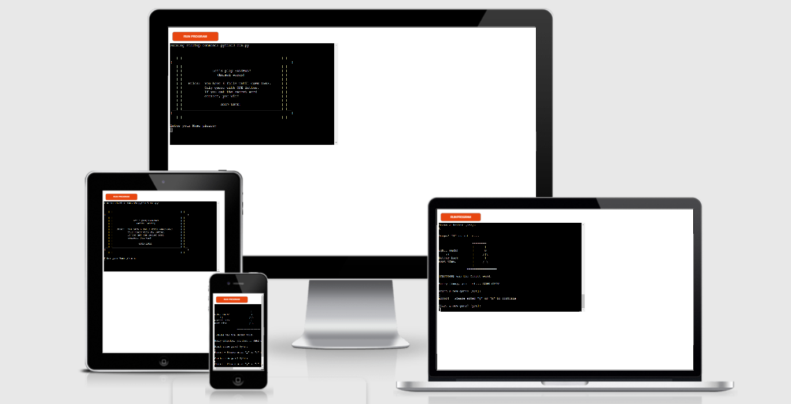
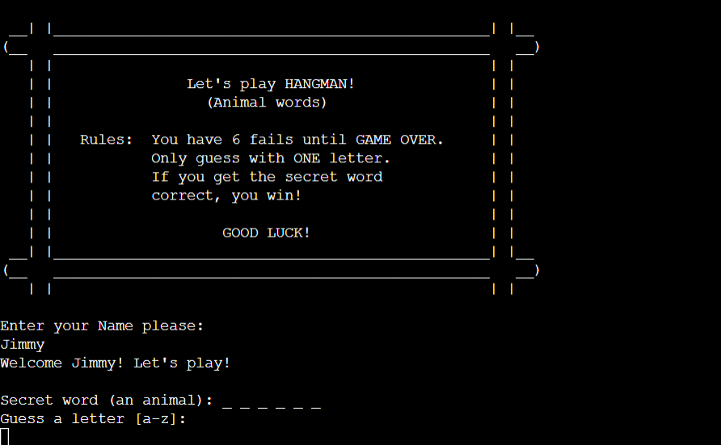
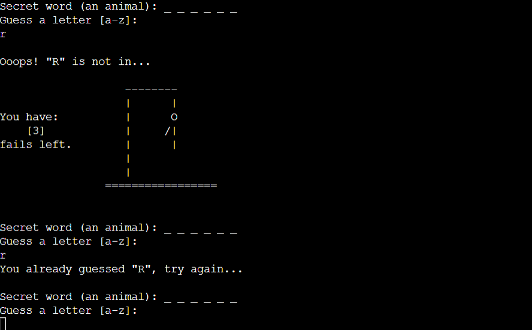
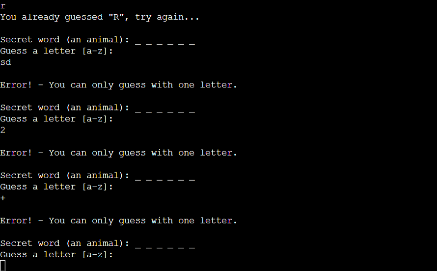
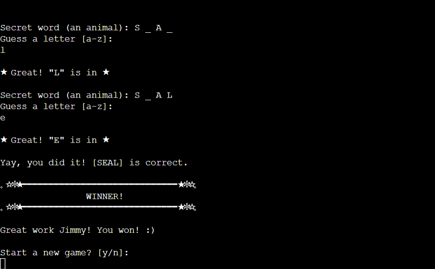
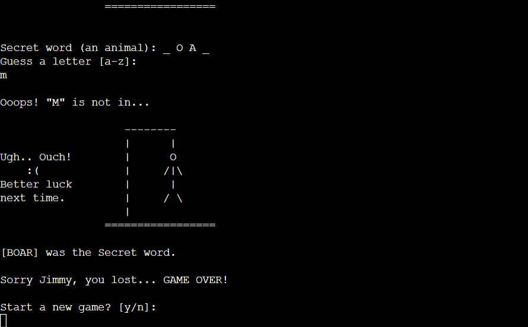
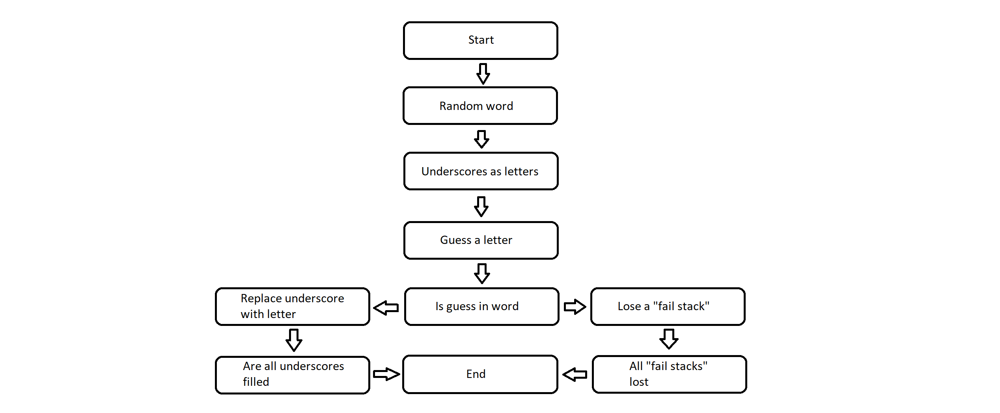
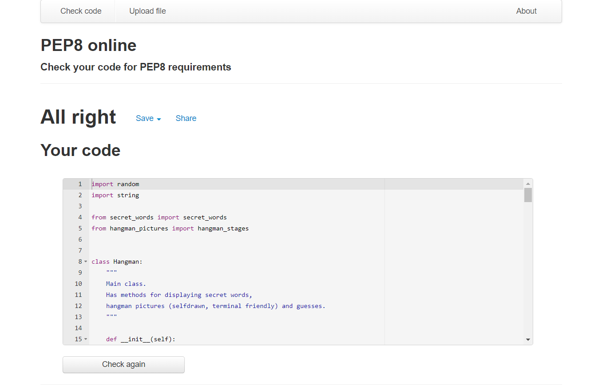

# **HANGMAN**
"Hangman" is a python terminal game, which runs in a terminal on Heroku (https://www.heroku.com/).
This fun little game is for people that enjoy to challenge themself, and of course for "hangman game" addicts.

Users get a random word they need to guess, one letter at the time. But beware, if you get 6 failed guesses, you lose!
Sounds easy right? Well... it's not! Go try and see: https://hangman-game3.herokuapp.com/
  

## How to play
***

This game is a classic hangman game, you can read more about hangman here: https://en.wikipedia.org/wiki/Hangman_(game)

    - This game will start when landing on this domain: https://hangman-game3.herokuapp.com/
    - First, user needs to enter a Name.
    - User will get a random "Secret word" from our library (100 secret words added, animalwords only).
    - And now the user can start to guess a letter. User will only see "underscores" as the secret word, so if the secret word is "LION", the user will see "_ _ _ _".
    - User can guess one letter at the time, and get '6 fails' until he/she fails the game.
    - If user manage to guess all letters right in the secret word, it's a win!

## Features
***

* **Existing Features**

    - The secret word is randomly picked from the 'secret_words' file (animal words).
    - User have no clue what the secret word is, it shows "underscores" as letters to the user.
    - Maintain number of fails.
    - Accepts user inputs.
    - Input validation and error checking.
        - User must enter a Name when starting.
        - User must enter one letter when guessing.
        - User cannot guess the same letter twice.
        - User cannot guess with 2+ letters, ONE letter only for each guess.
        - User cannot enter 'numbers' or 'special characters' when guessing a letter.
    - Data maintained in the class instance Hangman.
    - An 'ascii hangman art' is shown for each failed letters guessed.
    - When a user win, he/she can play a new game or quit game.
    - When a user lose, he/she can play a new game or quit game.
  

* **Future Features**

    - Add more "Secret words".
    - Add categories for secret words (exampel: press '1' for animal words / press '2' for city words etc).
  

## Data Model
***

I used a Hangman class as my model. The Hangman class stores the secret word.
The class also has methods to help play the game, such as tracks letters in a secret word, check current status on the game, track if a guessed letter is correct and also track if/when a user wins. Also using 'while loops' for validation and for creating a game loop.
  

## UX
***

A Hangman enthusiast or a thrill seeker will find this game very fun!
I bet the user will play until he/she falls asleep.
  

* **User stories**

    - NEW USER: I am interested in Hangman games, and want to guess as many secret words I can!
    - RETURNING USER: User can show their family/friends this game, and play together.
  

* **Game goal**

    - The goal of the game is to have fun and test your 'hangman skills'.
  

* **Business owner**

    - I want to entertain my users, and provide them with many laughs!
    - This game will add alot of positive vibes to the users.
  

* **Wireframes**

    - I made a flow chart to get a better understanding of the game steps.
  

## Testing
***

* **Validator testing**

    - PEP8
        - No errors or warnings detected when checked on: http://pep8online.com/
  

## Bugs
***

    - No bugs detected.

## Unfixed bugs
***

    - No unfixed bugs.

## Technologies
***

* **Languages used**

    - Python

## Programs
***

    - Gitpod, used for code writing.
    - Githud, store data.
    - Git, version control.
    - Heroku, for deployment.

## Deployment
***
This project was deployed using Code Institute's template for Heroku.

* **Was deployed to Heroku. The steps are:**

    - Create a new Heroku app.
    - Set the buildpacks to python and NodeJS in correct order.
    - Link the heroku app to correct repository.
    - Click on Deploy.
  

## Credits
***
To complete this 'Hangman game' I used Code Institute student template: https://github.com/Code-Institute-Org/python-essentials-template

Taken inspiration from: https://www.youtube.com/watch?v=lJ7RhvNvsnc / https://www.youtube.com/watch?v=ZQctDp1I-LE
  

* **Content**

    - All animal words generated here: https://www.randomlists.com/random-animals
    - Learned "enumerate code" code here: https://realpython.com/python-enumerate/
    - Learned arcii art here: https://www.messletters.com/
    - Learned 'string.ascii_letters' from: https://tinyurl.com/5n88vmfa
    - Used Tinyurl to shorten the links - https://tinyurl.com/app/
  

* **Media**

    - Used windows paint to create a flow chart, and crop images for readme file.
  

[Back to Top](#HANGMAN)